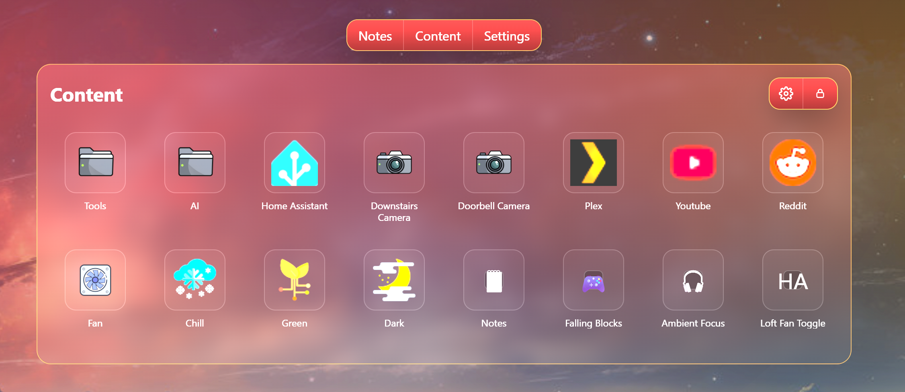

# VortNotes

VortNotes is a Flask + SQLite notes app with multi-database support, uploads,
content/media grids, themes, DB ZIP backup/import, and Docker/Unraid support.



Current release: **1.0.8**. VortNotes is distributed under the MIT License; see
`LICENSE` and `THIRD_PARTY_NOTICES.md`.

The public Docker image is multi-architecture:

- `linux/amd64` for PCs, servers, and Unraid
- `linux/arm64` for Raspberry Pi 64-bit and other ARM64 systems

Docker image:

```text
vorticon/vortnotes:latest
```

For a focused setup walkthrough, see [INSTALL.md](INSTALL.md). It includes
Unraid, PC, Raspberry Pi, Docker Compose, HTTPS, update, and backup examples.

## Features

- Multi-database notes with optional per-database passwords
- Rich text editing, uploads, media browsing, and content tiles
- Built-in apps and games, including sticky notes and ambient focus
- Home Assistant shortcuts and read-only public access options
- Admin settings for themes, backups, upload limits, permissions, and HTTPS
- Docker-first deployment for Unraid, PCs, servers, and Raspberry Pi

## Data Storage

VortNotes stores persistent data under `NOTES_DATA_DIR`. In Docker, use:

```text
NOTES_DATA_DIR=/data
```

Always map `/data` to a host folder. Do not store persistent data only inside
the container layer.

Persistent data layout:

```text
/data/dbs/                SQLite database files
/data/uploads/            attachments, content files, icons, backgrounds
/data/backups/            DB ZIP backups
/data/config/config.json  app settings
/data/.secret_key         stable Flask session secret
/data/logs/               logs
```

## Docker Install: Linux Server

```bash
mkdir -p ~/vortnotes-data

docker run -d \
  --name vortnotes \
  --restart unless-stopped \
  -p 8000:8000 \
  -e NOTES_DATA_DIR=/data \
  -v ~/vortnotes-data:/data \
  vorticon/vortnotes:latest
```

Open:

```text
http://SERVER-IP:8000
```

## Docker Install: Raspberry Pi

Use a 64-bit Raspberry Pi OS when possible. The Docker image supports
`linux/arm64`.

```bash
mkdir -p /home/pi/vortnotes-data

docker run -d \
  --name vortnotes \
  --restart unless-stopped \
  -p 8000:8000 \
  -e NOTES_DATA_DIR=/data \
  -v /home/pi/vortnotes-data:/data \
  vorticon/vortnotes:latest
```

Open:

```text
http://RASPBERRY-PI-IP:8000
```

## Docker Install: Windows

Install Docker Desktop first, then run this in PowerShell:

```powershell
mkdir C:\VortNotes\data

docker run -d `
  --name vortnotes `
  --restart unless-stopped `
  -p 8000:8000 `
  -e NOTES_DATA_DIR=/data `
  -v C:\VortNotes\data:/data `
  vorticon/vortnotes:latest
```

Open:

```text
http://localhost:8000
```

## Docker Compose

Create `docker-compose.yml`:

```yaml
services:
  vortnotes:
    image: vorticon/vortnotes:latest
    container_name: vortnotes
    restart: unless-stopped
    ports:
      - "8000:8000"
    environment:
      NOTES_DATA_DIR: /data
    volumes:
      - ./vortnotes-data:/data
```

Start:

```bash
docker compose up -d
```

## HTTPS

For public deployments, the recommended setup is a TLS-terminating reverse
proxy such as Caddy, Nginx, or Traefik in front of VortNotes. Forward requests
to `http://vortnotes:8000`, set `VORTNOTES_TRUST_PROXY_HEADERS=1`, and set
`VORTNOTES_FORCE_SECURE_COOKIES=1`. Only enable trusted proxy headers when
exactly one trusted proxy controls the connection to VortNotes.

Direct HTTPS is also supported. Mount a certificate and its private key
read-only and set both paths:

```bash
docker run -d \
  --name vortnotes \
  --restart unless-stopped \
  -p 8443:8000 \
  -e NOTES_DATA_DIR=/data \
  -e VORTNOTES_TLS_CERT_FILE=/certs/fullchain.pem \
  -e VORTNOTES_TLS_KEY_FILE=/certs/privkey.pem \
  -v ~/vortnotes-data:/data \
  -v /path/to/certs:/certs:ro \
  vorticon/vortnotes:1.0.8
```

Open `https://SERVER-IP:8443`. The certificate must match the hostname used by
clients. Direct local runs with `python -m vortnotes` use the same two
environment variables. Never commit certificate private keys.

On Unraid, certificate files should be owned by `nobody:users`; keep the private
key restricted but group-readable (for example, mode `640`).

Instead of environment variables, an administrator can open **Settings →
Config**, enable direct HTTPS, and enter the in-container certificate and key
paths. The certificate folder must already be mounted read-only (normally at
`/certs`), and the container must be restarted after saving. Environment
variables override the admin-panel setting.

For local or home-network installs, **Settings → Config** can also generate a
unique self-signed certificate for the current install. The generated files are
stored under:

```text
/data/config/tls/vortnotes-selfsigned.crt
/data/config/tls/vortnotes-selfsigned.key
```

The app enables direct HTTPS after generation, but you still need to restart the
container/app and reconnect with `https://`. Browsers will warn because the
certificate is self-signed; this is expected. Do not use a shared certificate or
private key across installs.

The container runs as UID/GID `10001`. Existing bind mounts must be writable by
that identity, for example `sudo chown -R 10001:10001 ~/vortnotes-data`.

Update:

```bash
docker compose pull
docker compose up -d
```

## Unraid Install

Recommended container settings:

```text
Repository:      vorticon/vortnotes:latest
WebUI:           http://[IP]:[PORT:9999]/
Container port:  8000
Host port:       9999
```

Required path mapping:

```text
Name:           App Data
Host Path:      /mnt/cache/appdata/vortnotes
Container Path: /data
Access:         Read/Write
```

If your appdata share lives on `/mnt/user`, this also works:

```text
Host Path:      /mnt/user/appdata/vortnotes
Container Path: /data
```

Using `/mnt/cache/appdata/vortnotes` makes VortNotes report cache-pool disk
usage. Using `/mnt/user/appdata/vortnotes` may report the larger Unraid user
share/array usage.

Required variable:

```text
NOTES_DATA_DIR=/data
```

Optional variables:

```text
WEB_CONCURRENCY=2
THREADS=2
TIMEOUT=120
```

For HTTPS on Unraid, prefer its reverse-proxy ecosystem and set
`VORTNOTES_TRUST_PROXY_HEADERS=1` plus `VORTNOTES_FORCE_SECURE_COOKIES=1`.
Alternatively, generate a unique self-signed certificate from **Settings →
Config**, or mount a read-only certificates folder and set the two
`VORTNOTES_TLS_*` variables documented above.

The supplied Unraid template runs as `nobody:users` (`99:100`) so new installs
can write normal Unraid appdata without manual ownership changes. It also
provides an optional read-only `/certs` mapping for the admin HTTPS control.

### Unraid Appdata Share

For SSD/cache-only appdata, set the Unraid `appdata` share to:

```text
Primary storage:   Cache
Secondary storage: None
```

If Secondary storage is `Array`, Unraid may allow appdata files to spill to the
array depending on mover/share settings.

## Unraid Legacy Migration

Older VortNotes templates used separate mappings:

```text
/mnt/user/appdata/vortnotes/uploads -> /app/uploads
/mnt/user/appdata/vortnotes/dbs     -> /app/dbs
/mnt/user/appdata/vortnotes/config/config.json -> /app/config/config.json
```

Current VortNotes uses one data root:

```text
/mnt/cache/appdata/vortnotes -> /data
NOTES_DATA_DIR=/data
```

VortNotes has a compatibility fallback for old `/app/...` mappings. To migrate
old mapped data into `/data`:

1. Add the new root mapping:

   ```text
   /mnt/cache/appdata/vortnotes -> /data
   ```

2. Keep the old `/app/...` mappings for one startup.

3. Add this variable:

   ```text
   VORTNOTES_MIGRATE_LEGACY_APP_DATA=1
   ```

4. Start the container once.

5. Verify:

   ```bash
   docker exec -it Vortnotes sh -lc '
   ls -la /data
   ls -la /data/dbs
   ls -la /data/uploads | head -50
   '
   ```

6. Edit the container again:

   - Remove old `/app/uploads`, `/app/dbs`, and `/app/config/config.json`
     mappings.
   - Remove `VORTNOTES_MIGRATE_LEGACY_APP_DATA` or set it to `0`.
   - Keep only the `/data` mapping.

The migration copies data and leaves the old source files in place. It writes:

```text
/data/.legacy_app_migration_complete
```

## Updating Docker

Plain Docker:

```bash
docker pull vorticon/vortnotes:latest
docker stop vortnotes
docker rm vortnotes
docker run -d \
  --name vortnotes \
  --restart unless-stopped \
  -p 8000:8000 \
  -e NOTES_DATA_DIR=/data \
  -v ~/vortnotes-data:/data \
  vorticon/vortnotes:latest
```

Unraid:

1. Go to Docker.
2. Click VortNotes.
3. Choose Update or Force Update.
4. Confirm the `/data` mapping still points to appdata.

## Backups

The app has DB ZIP backup/import tools under Settings. Backups are stored in:

```text
/data/backups
```

For host-level backups, copy the whole data folder:

```bash
tar -czf vortnotes-data-backup.tgz ~/vortnotes-data
```

For Unraid, back up:

```text
/mnt/cache/appdata/vortnotes
```

or the appdata path you mapped to `/data`.

## Common Environment Variables

```text
NOTES_DATA_DIR=/data
PORT=8000
WEB_CONCURRENCY=2
THREADS=2
TIMEOUT=120
LOG_LEVEL=INFO
```

Upload limits:

```text
VORTNOTES_MAX_CONTENT_LENGTH_MB=50
VORTNOTES_INLINE_MEDIA_MAX_MB=50
VORTNOTES_ATTACHMENT_MAX_MB=50
VORTNOTES_ATTACHMENT_MAX_GB=
```

Security:

```text
VORTNOTES_FORCE_SECURE_COOKIES=1
VORTNOTES_ADMIN_PASSWORD=
```

Use `VORTNOTES_FORCE_SECURE_COOKIES=1` only when serving through HTTPS or a TLS
reverse proxy.

`VORTNOTES_ADMIN_PASSWORD` is an optional first-run bootstrap. It sets the admin
password only when no admin password is already configured; later in-app password
changes are not overwritten by the environment variable.

## Health Checks

```text
GET /healthz
GET /about
```

`/healthz` returns a small JSON health check.

## Local Development Without Docker

Linux/macOS:

```bash
python -m venv .venv
source .venv/bin/activate
pip install -r requirements.txt

export NOTES_DATA_DIR=./data
flask --app vortnotes:create_app run --debug
```

Windows PowerShell:

```powershell
python -m venv .venv
.\.venv\Scripts\Activate.ps1
pip install -r requirements.txt

$env:NOTES_DATA_DIR = ".\data"
flask --app vortnotes:create_app run --debug
```

Run tests:

```bash
pip install -r requirements-dev.txt
pytest
```

## Build And Push Docker Images

Single-architecture local build:

```bash
docker build -t vorticon/vortnotes:latest .
```

Multi-architecture Docker Hub build:

```bash
docker buildx build \
  --platform linux/amd64,linux/arm64 \
  -t vorticon/vortnotes:latest \
  -t vorticon/vortnotes:YYYYMMDD-HHMMSS-multiarch \
  --push .
```
